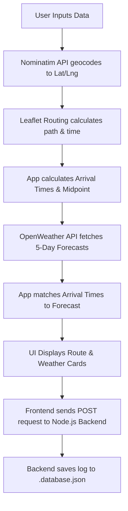

# Project Overview: Predictive Weather Guidance with Route Planning

## 🎯 What It Does
This web application is a smart trip planner. Unlike standard GPS apps that only show you the weather at your destination *right now*, this app predicts what the weather will be like *when you actually get there*. 

You input a Start Location, a Destination, and a Departure Time. The app draws your road trip on an interactive map, calculates your exact driving time, and then fetches the forecasted weather for your Start, Midpoint, and Destination at the exact hour you are mathematically expected to arrive at each point. It also generates automatic safety warnings if it detects rain, strong winds, or thunderstorms on your path. 

All of your searches are permanently logged in a secure, local backend database which you can view through an Admin-only portal, protected by an interactive CAPTCHA and encrypted password system.

## ⚙️ How It Does It (The Full-Stack Architecture)
This is a **Full-Stack Application** featuring a browser-based frontend and a Node.js/Express backend server.

### 1. Frontend Technologies
- **OpenStreetMap / Nominatim API:** Handles converting human-readable location names into exact GPS coordinates (Geocoding) and vice-versa (Reverse Geocoding).
- **Leaflet & Leaflet Routing Machine:** Renders the interactive map and calculates the fastest driving paths and travel times.
- **OpenWeather Forecast API:** Fetches the 5-day future weather data in 3-hour chunks based on coordinates.
- **Vanilla JS & CSS3:** Provides a modern "Glassmorphism" UI with zero page reloads.

### 2. Backend Technologies
- **Node.js & Express.js:** A lightweight local server that hosts our API endpoints (`/api/history`, `/api/login`, `/api/register`, `/api/captcha`).
- **File-based NoSQL Database (`.database.json`):** Acts as our primary database to permanently store search history. It is hidden (prefixed with a dot) to prevent Live Server dev-tools from accidentally refreshing the browser.
- **Security (`bcryptjs` & `.users.json`):** A secondary database holds registered administrators. Passwords are cryptographically scrambled (hashed) using `bcryptjs` so they are never stored as plain text.
- **Bot Protection (`svg-captcha`):** Dynamically generates distorted images (CAPTCHAs) directly on the local server without relying on third-party trackers.

---

## 🔒 Security & Admin Features

### 1. Secure Admin Portal
The database of searched routes is hidden behind a strict Admin Login portal. 
- **CAPTCHA Challenge:** Before logging in, users must pass a visual "Picture and Letter" test generated natively by the server. Incorrect answers result in the immediate generation of a new challenge.
- **Encrypted Login:** Login credentials are encrypted and verified against hashes on the backend.

### 2. Registration & Password Strength Validator
Inside the Admin Portal, an existing Admin can register new users.
- **Real-Time Validation:** The password field features an interactive checklist that updates dynamically using Regular Expressions (`RegEx`).
- **Strict Requirements:** A password must contain at least 8 characters, an uppercase letter, a lowercase letter, a number, and a special character before the Registration button physically unlocks.

---

## ⚖️ Upsides, Downsides & Limitations

### 🌟 Upsides
- **Highly Secure:** Uses industry-standard `bcryptjs` password hashing and native CAPTCHAs, preventing data exposure and automated bot attacks.
- **Cost Effective:** Relies entirely on free-tier APIs. 
- **Privacy Respecting:** Location data stays between the user's browser and the public APIs. The server uses a local database rather than a cloud-hosted solution.
- **Single-Page Simplicity:** Fluid "Glassmorphism" UI that doesn't require page reloads.

### 🛑 Downsides & Limitations
- **Nominatim's Search Limitations:** Nominatim is great for towns and cities but struggles with specific street addresses or local shops compared to Google Maps.
- **Weather Granularity:** The free OpenWeather API provides forecasts in **3-hour chunks**. If you arrive at 4:30 PM, the app uses the 3:00 PM or 6:00 PM forecast. It is an approximation, not a minute-by-minute prediction.
- **API Rate Limits:** Free APIs have rate limits. If thousands of people used this app at the exact same second, Nominatim or OpenWeather might temporarily block the requests.

---

## 📖 How to Understand the Code (File Walkthrough)

To understand the project, you need to understand how the full-stack architecture works together:

### 1. `server.js` (The Backend Brain)
This Node.js file is the heart of our data persistence and security.
- Contains the `initUsersDB()` function which automatically creates a default Admin account on first launch.
- Provides RESTful API endpoints like `POST /api/login` and `GET /api/history` for the frontend to communicate with.
- Manages the reading and writing of the `.database.json` and `.users.json` files.

### 2. `index.html` & `styles.css` (The Skeleton & Skin)
- Uses modern CSS Flexbox and Grid to ensure the weather cards stack neatly on mobile phones and sit side-by-side on desktop screens.
- Defines the hidden Modals (Popups) for the Login screen and Database table, applying a `backdrop-filter: blur(12px)` for the frosted glass effect.

### 3. `script.js` (The Frontend Brain)
- **Autocomplete & Geocoding:** Uses a **Debounce** function to prevent spamming the Nominatim API while the user types.
- **Routing & Weather:** Feeds coordinates into Leaflet Routing Machine. LRM draws the blue line, the script slices the path array in half to find the Midpoint, calculates the arrival times, and calls `Promise.all` to fetch the OpenWeather forecasts simultaneously.
- **API Communication:** Uses the modern `fetch()` API to send the final route data to the Node.js backend. It also handles all of the API calls for the Login, Captcha verification, and Registration systems.
